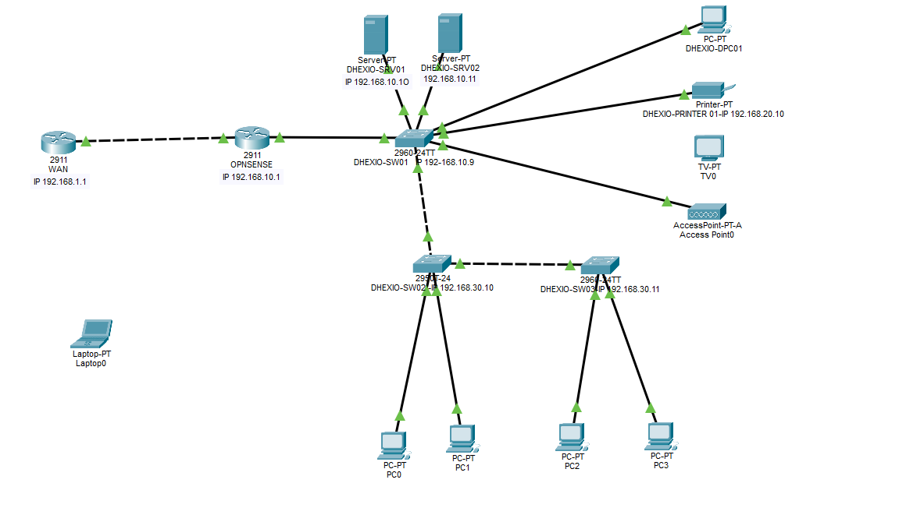

# 🖥️ DHEXIO — Infraestructura de Homelab

Proyecto de infraestructura propio: diseño, despliegue y administración de un entorno completo con Active Directory, segmentación de red, firewall, virtualización de servicios y seguridad.

Documentado fase por fase como registro técnico del trabajo realizado.

---

## 🏗️ Infraestructura

| Componente | Detalle |
|---|---|
| Servidor 1 | Lenovo M90q — Ubuntu Server + Docker |
| Servidor 2 | Lenovo M710 — Windows Server 2022 |
| Switch principal | TP-Link SG608E |
| Switches de laboratorio | Cisco 2950 / Cisco 2960 |
| Firewall | OPNsense |

## 📍 Topología de Red

## 🧪 Fase 2 — Simulación de VLANs y Routing (Cisco Packet Tracer)

Antes de aplicar la segmentación en los switches Cisco reales del laboratorio (2950/2960), se diseñó y validó el escenario completo en Cisco Packet Tracer: routing inter-VLAN, conectividad entre segmentos y comportamiento esperado antes de tocar el hardware físico.

---

## 🗺️ Progreso del Proyecto

| Fase | Estado |
|---|---|
| Fase 1 — Topología y segmentación VLANs | ✅ Completado |
| Fase 2 — Simulación VLANs (Packet Tracer) | ✅ Completado |
| Fase 3 — Active Directory | 🔨 En construcción |
| Fase 4 — OPNsense (NAT, routing, firewall) | 🔨 En construcción |
| Fase 5 — Docker / servicios | 🔨 En construcción |
| Fase 6 — VPN WireGuard | 🔨 En construcción |
| Fase 7 — Hardening y seguridad | 🔨 En construcción |

---

## 📬 Contacto

- 💼 [LinkedIn](https://www.linkedin.com/in/didhier-palacios)
- 📧 didhierpalacios@gmail.com
